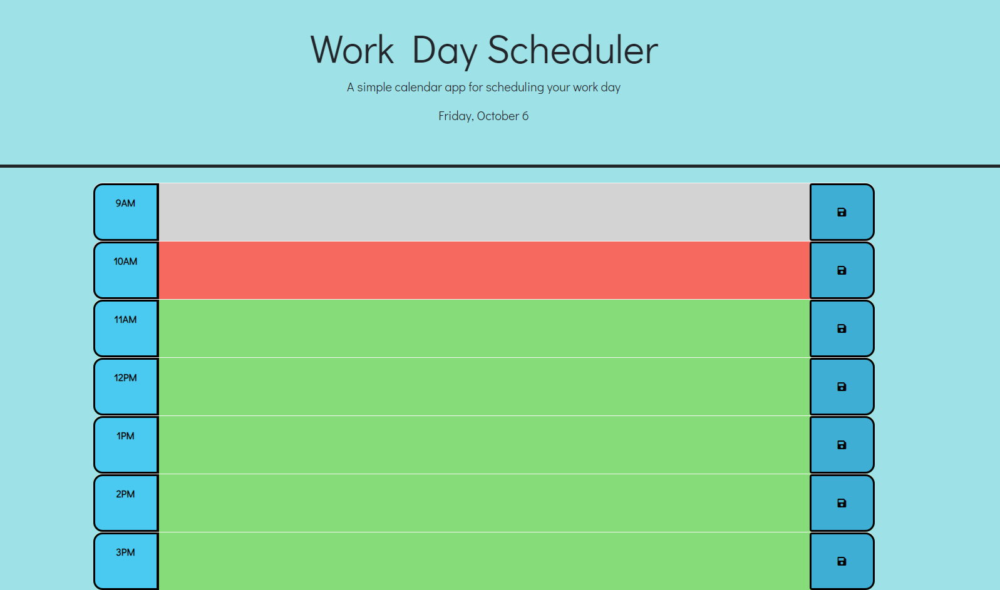
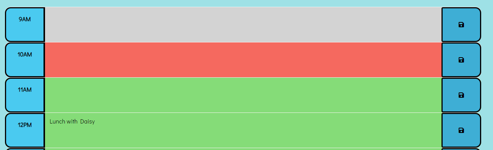
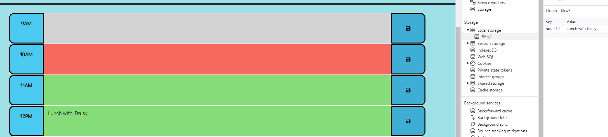

# Challenge 5 
Work Scheduler

**Goal**
To create a simple calendar application that allows a user to save events for each hour of a typical working day (9am–5pm). The app will run in the browser and feature dynamically updated HTML and CSS powered by jQuery and also using dayjs library. 

**Scope of Work**
The user will have access to the work scheduler to plan for the day. The schedule will have time from 9am-5pm. Each of the time block will have a color code that represent past, present, and future. The user can save their task on the schedule from the click on the save button. The user will not have to worry about being erasred as it will be saved until the user manually deletes the task!

**The quiz should contain the following:**
Must use jQuery.
The color of the schedule will be changed reflecting the present, past, & future. 
The user input will be saved in local Storage.
The user input will show up on the page when refreshed. 
 

**Work Scheduler**

**The color coded time schedule.**

**The user inputs their task for the day**

**When refreshed it is still present on the page**

**Languages**
HTML, CSS, JavaScript. jQuery, Bootstraps, GoogleFonts, & Dayjs 

**Credits**
Edited by Kai Gurung-Doll; https://github.com/KaiDoll.
Link to the Challenge: https://kaidoll.github.io/my-work-scheduler/